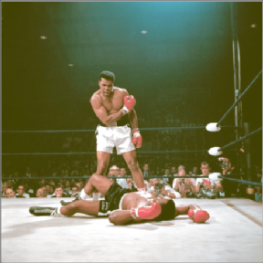

<!-- README.md is generated from README.Rmd. Please edit that file -->

# Instant film simulation

-   A fun bit of code to try and simulate the old instant film aesthetic
    in R with the `magick` and `tidyverse` packages…Insta**gg**ram?
-   This is a small proof of concept - extremely inefficient

``` r
library(tidyverse)
library(magick)
```

-   Define desired image width in pixels
-   Compute the image height for a given aspect ratio. For this instant
    film look I want a square image

``` r
w <- 500
asp <- 1
h <- w*asp
```

### Read image

-   Read image and resize
-   Remove 2 pixels from width and height to compensate for the single
    pixel border that will be added to all sides of the image later on
    -   This keeps the overall image at the width specified above

``` r
i <- 
  image_read('https://images.squarespace-cdn.com/content/v1/5b670534b98a78d5e84a7d19/1579598597207-VI1ZBYIV4PYHLWHA59AM/Ali-vs-Liston.png?format=1000w') %>%
  image_scale(geometry = paste0(w-2,"x",h-2,"^")) %>%
  image_crop(geometry = paste0(w-2,"x",h-2), gravity = "center")
  
image_ggplot(i)
```

<!-- -->

### Image modifications in `magick`

-   Desaturate the colours/increase brightness
-   Add a colour cast
-   Add a border
-   Add some blurring

``` r
i_edit <-
  i %>% 
  image_modulate(saturation = 80, brightness = 110) %>%
  image_composite(
    image_colorize(i, 25, "yellow"),
    gravity = "center",
    operator = "Lighten") %>%
  image_border(geometry = paste0(1, "x", 1), color = "grey40") %>%
  image_blur(radius=1, sigma = 1.5)

image_ggplot(i_edit)
```

<!-- -->

### Define curve to fade darker tones

-   If I could work out how to do this within the `magick` package
    itself - I wouldn’t need to implement this whole (rather
    inefficient) section!
-   Convert image to a dataframe and rescale RGB to go from 0 to 1
-   Define a curve to fade the darker tones in the image - this helps to
    gove the ‘film look’
-   Create a spline function for the curve
-   Visualise the curve over the image RGB distributions

``` r
i_edit_df <-
  i_edit %>%
  image_raster() %>%
  as_tibble() %>%
  mutate(col2rgb(col) %>% t() %>% as_tibble()) %>%
  mutate(across(c(red, green, blue), 
                .fns = ~scales::rescale(.x, to=c(0,1), from=c(0,255))))

# Curve dataframe (CDF)
cdf <-
  tribble(
    ~x, ~y,
    0.0, 0.3,
    0.5, 0.5,
    0.6, 0.6,
    0.7, 0.7,
    0.8, 0.8,
    0.9, 0.9,
    1.0, 1.0
  )

# Create curve as spline
sf <- splinefun(x = cdf$x, y = cdf$y, method = "natural")

curve <-
  tibble(x = seq(0,1,l=100)) %>%
  mutate(y = sf(x),
         y = case_when(y < 0 ~ 0, y > 1 ~ 1, TRUE ~ y))

# Visualise curve
ggplot()+
  geom_density(data = i_edit_df %>% pivot_longer(c(red, green, blue)),
               aes(value, after_stat(..scaled..), fill=I(name)),
               col = NA, 
               alpha=1/2) +
  geom_line(data = curve, aes(x, x), lty=2)+
  geom_line(data = curve, aes(x, y))+
  geom_point(data = cdf, aes(x, y))+
  facet_wrap(~name)+
  coord_equal()
```

<!-- -->

### Make the frame

-   Compute the width of the borders for the frame
    -   I used approximate values based on
        [these](https://support.polaroid.com/hc/en-us/articles/115012363647-What-are-Polaroid-photo-dimensions-)
-   Create dataframe of all coordinates and remove the area for the
    image

``` r
# Width/height ratio
w_r <- 88.5/79
h_r <- 107.5/79

# Left/right/top border widths
total_width <- w * w_r
l <- round((total_width - w)/2)
r <- l
t <- l

# Bottom border width
total_height <- h*h_r
b <- round(total_height - t - h)

frame <-
  crossing(x = 1:(l + r + w), y = 1:(b + h + t)) %>%
  filter(!(x > l & x <= w+r & 
             y > t & y <= h+t)) %>%
  mutate(col_adj = "#e6e3dbff")
```

### Final output

-   Apply the spline curve to the image
-   Add the frame
-   Plot!

``` r
i_edit_df %>%
  mutate(across(c(red, green, blue), .fns = sf)) %>%
  mutate(across(c(red, green, blue), .fns = ~case_when(.x < 0 ~ 0, .x > 1 ~ 1, TRUE ~ .x))) %>%
  transmute(x = x + l,
            y = y + t,
            col_adj = rgb(red, green, blue)) %>%
  bind_rows(frame) %>%
  ggplot()+
  geom_raster(aes(x, y, fill=I(col_adj)))+
  scale_y_reverse()+
  coord_equal()+
  theme_void()
```

<!-- -->

### Extra

-   As an interesting aside - I want to visualise the impact of all the
    different composite operators for this colour cast
-   Composite type four (blur) is used with a “2x2” geometry - but i’m
    not sure what this means or what options there are…

``` r
map2(compose_types(), 
     c(rep("", 3), "2x2", rep("", length(compose_types())-4)),
    ~image_composite(i, 
                     image_colorize(i, 30, "yellow"), 
                     operator = .x, compose_args = .y) %>% 
      image_annotate(text=.x, size=50, color = "orange")) %>% 
  image_join() %>% 
  image_montage(tile = "9x9") %>% 
  image_ggplot()
```

<!-- -->
